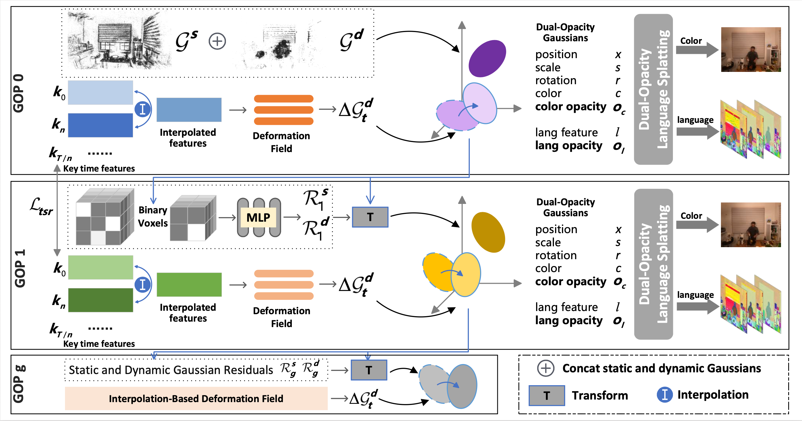

# [ECCV'26] DLGStream: Dynamic Language-embedded Guassian Splatting for Open-vocabulary Enabled Free-viewpoint Video Streaming
[Zhihui Ke](https://github.com/kkkzh/), Yuyang Liu, Xiaobo Zhou, Tie Qiu

[[`Paper`](https://github.com/kkkzh/DLGStream)] [[`Github`](https://github.com/kkkzh/DLGStream)]

## Overview
<p align="left">

</p>

DLGStream is a novel language-embedded Free-Viewpoint Video representation that streams time-varying language features alongside Gaussian attributes to support 4D environment interaction, scene editing, and spatial intelligence. Specifically, we propose a dual-opacity dynamic language Gaussian representation, which maintains two opacity attributes for color and language features to deal with performance degradation that occurs when colors and features are jointly optimized. Furthermore, we introduce an interpolation-based deformation field to reduce temporal redundancy. This deformation field can also be used for 4D frame interpolation, boosting FVV sequences from low to high FPS. Experimental results demonstrate that DLGStream achieves superior performance in both on open-vocabulary segmentation and reconstruction quality with an average frame size of merely 43KB.

## Installation
We tested our code on a server with Ubuntu 20.04.6, cuda 11.6, pytorch 1.13.1
1. Unzip files
```shell
cd thirdparty/gaussian_splatting/submodules
unzip 4d-langsplat-rasterization.zip
unzip diff-hac-rasterization.zip
unzip diff-swift-gaussian-rasterization.zip
unzip dualopa-langsplat-rasterization.zip
unzip arithmetic.zip
unzip gridencoder.zip
unzip simple-knn.zip
unzip fused-ssim.zip
unzip PLAS.zip  # please attention!!! pytorch 2.0+ cannot install PLAS
```
2. Install conda environment
```shell
sudo apt install ffmpeg

conda create -n dlgstream python=3.10
conda activate dlgstream

pip install torch==1.13.1+cu116 torchvision==0.14.1+cu116 torchaudio==0.13.1 --extra-index-url https://download.pytorch.org/whl/cu116

pip uninstall numpy
pip install numpy==1.26.4

pip install -r requirements.txt

pip install thirdparty/gaussian_splatting/submodules/4d-langsplat-rasterization
pip install thirdparty/gaussian_splatting/submodules/simple-knn
pip install thirdparty/gaussian_splatting/submodules/diff-hac-rasterization
pip install thirdparty/gaussian_splatting/submodules/diff-swift-gaussian-rasterization
pip install thirdparty/gaussian_splatting/submodules/dualopa-langsplat-rasterization
pip install thirdparty/gaussian_splatting/submodules/arithmetic
pip install thirdparty/gaussian_splatting/submodules/gridencoder
pip install thirdparty/gaussian_splatting/submodules/fused-ssim
pip install thirdparty/gaussian_splatting/submodules/PLAS
```

3. Install 4DLangSplat environment, please follow the guide from [4DLangSplat](https://github.com/zrporz/4DLangSplat). Note that do not install 4d-langsplat-rasterization from 4DLangSplat.

## Data
1. Download the multi-view video datasets:

**N3DV**:  https://github.com/facebookresearch/Neural_3D_Video

**MeetRoom**: https://drive.google.com/drive/folders/1lNmQ6_ykyKjT6UKy-SnqWoSlI5yjh3l_?usp=share_link

2. Preprocess dataset
> We follow [4DGS](https://github.com/hustvl/4DGaussians) to preprocess multi-view dynamic scene datasets
```shell
python script/preprocess_dynerf.py --datadir /home/kzh/dataset/N3DV/cut_roasted_beef --type n3dv

python runcolmap.py --root_dir /home/kzh/dataset/N3DV/cut_roasted_beef --start 0 --end 1 --type n3dv

python script/calc_std.py --path /home/kzh/dataset/N3DV/cut_roasted_beef --type n3dv
```

3. Extract language features
> We modify 4DLangSplat to extract language features of N3DV dataset.
```shell
python extract_lang_feats.py --work_path {dataset path}  --lang_feat_path  {language feature path}

# then train autoencoder to convert 512 dimension to 9 demension
sh autoencoder/train_autoencoder.sh  # need to modify path in this script

python autoencoder/symlink.py  --source_path {language feature path}  -target_path {dataset path}
```

## Training
```shell
# train all scenes
sh train_all_fdsd.sh  # You need to modify output_path and dataset_path
sh train_all_hac.sh
```

## Evaluation
```shell
sh eval_all.sh
```

## Contact
If you have any questions, please feel free to contact me via `kezhihui@tju.edu.cn`.

## Citation
If you find our work helpful, please consider citing:

```bibtex
@inproceedings{ke2026dlgstream,
  title={DLGStream: Dynamic Language-embedded Guassian Splatting for Open-vocabulary Enabled Free-viewpoint Video Streaming},
  author={Zhihui Ke, Yuyang Liu, Xiaobo Zhou, Tie Qiu},
  booktitle={European conference on computer vision},
  year={2026}
}
```

## LICENSE
- Please follow the LICENSE of [3DGS](https://github.com/graphdeco-inria/gaussian-splatting).

## Acknowledgement
- We thank all authors from [3DGS](https://github.com/graphdeco-inria/gaussian-splatting), [SOG](https://github.com/fraunhoferhhi/Self-Organizing-Gaussians/), [HAC](https://github.com/YihangChen-ee/HAC) and [4DLangSplat](https://github.com/zrporz/4DLangSplat) for presenting such an excellent work.
